# Comprehensive System Design - Real-Time Intelligent Data Stream Query Assistant

## System Overview

This system provides real-time intelligent querying capabilities over streaming data from Hive and DB2 databases through Kafka, with natural language query processing and intelligent insights generation.

## Core Architecture Patterns

### 1. Event-Driven Architecture

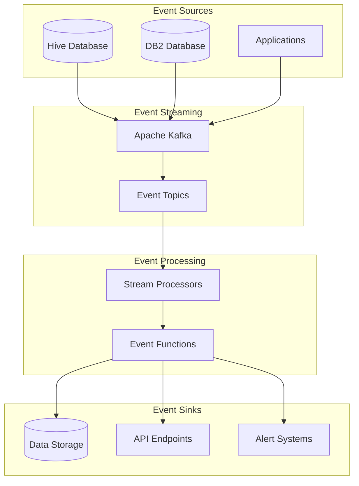

### 2. Microservices Architecture

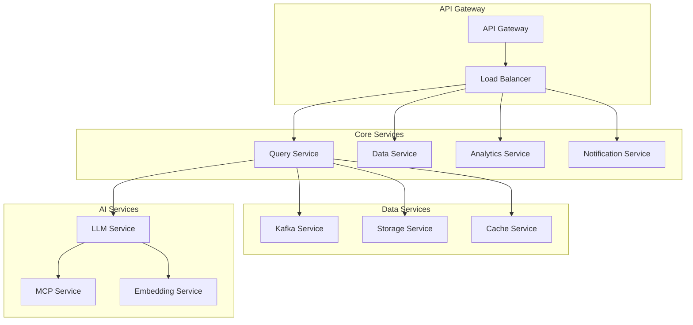

### 3. Data Lake Architecture

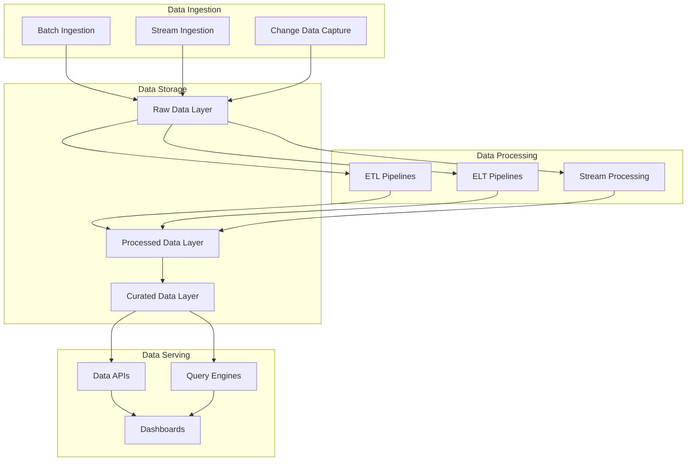

## Data Flow Architecture

### Real-Time Data Pipeline

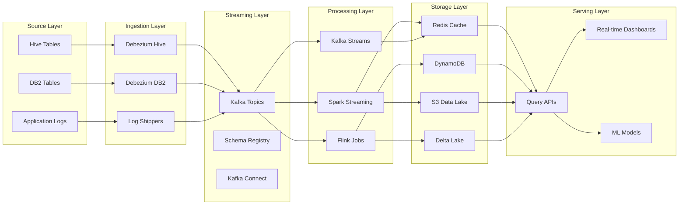

### Batch Processing Pipeline

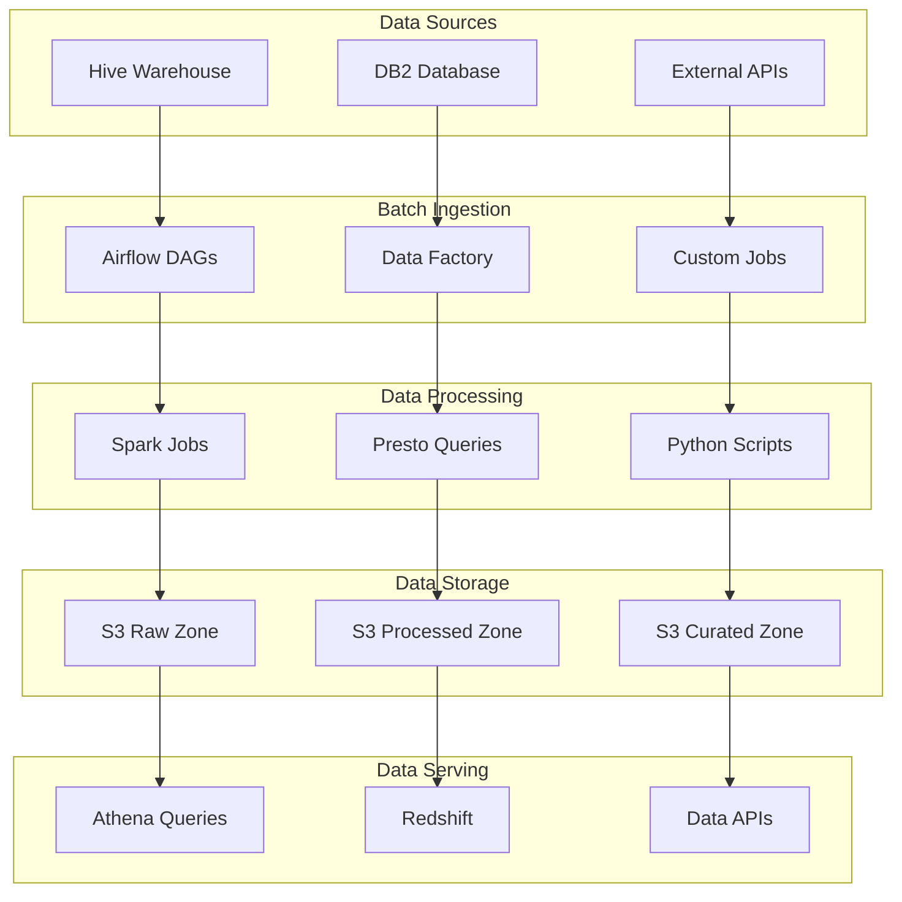

## Query Processing Architecture

### Natural Language Query Flow

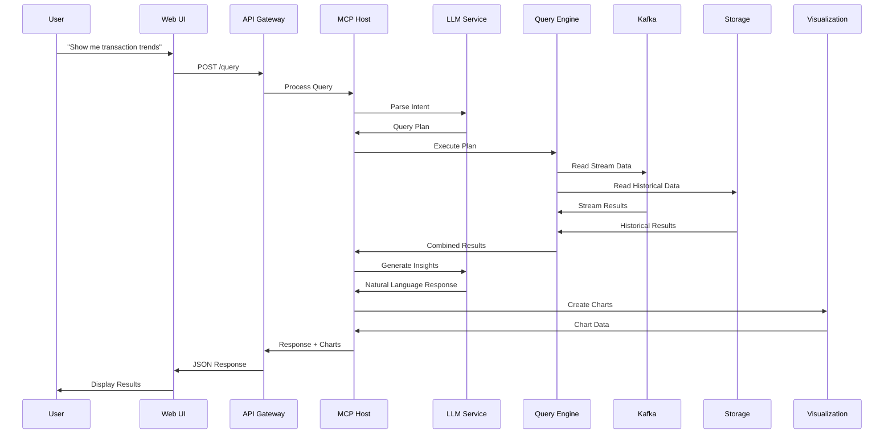

### Query Optimization Flow

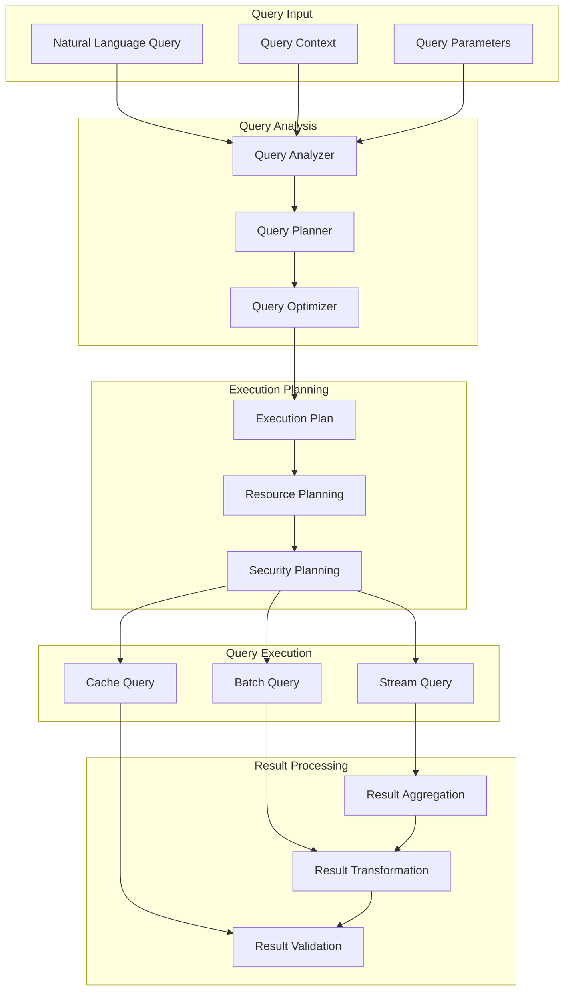

## Security Architecture

### Security Layers

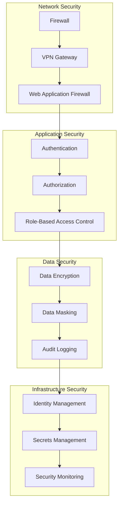

### Data Privacy Architecture

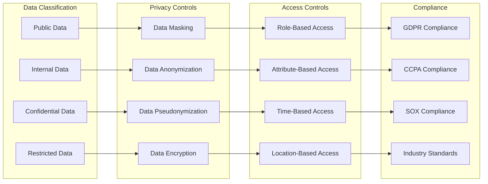

## Scalability Architecture

### Horizontal Scaling

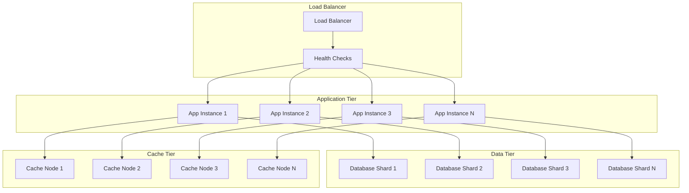

### Auto-Scaling Architecture

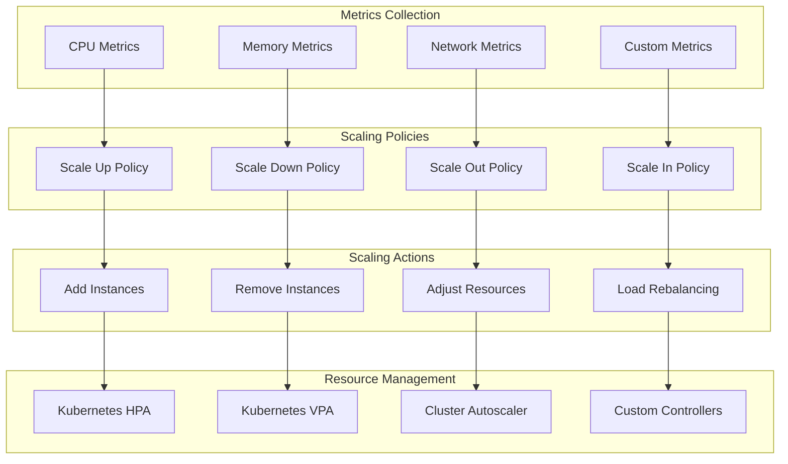

## Monitoring Architecture

### Observability Stack

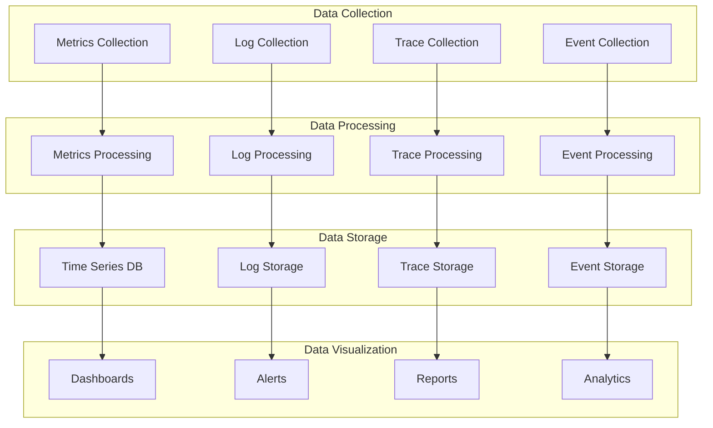

### Alerting Architecture

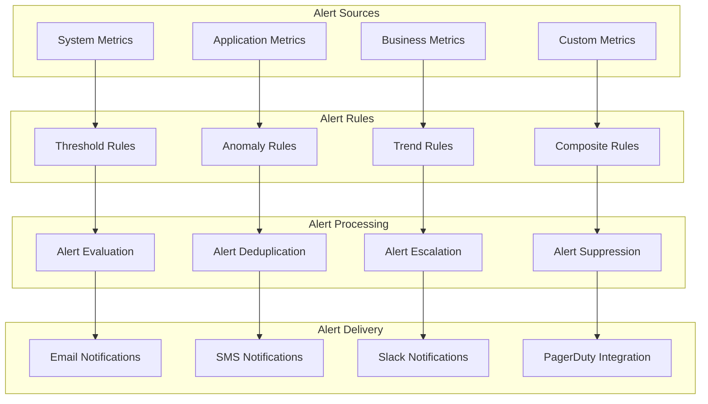

## Disaster Recovery Architecture

### Backup Strategy

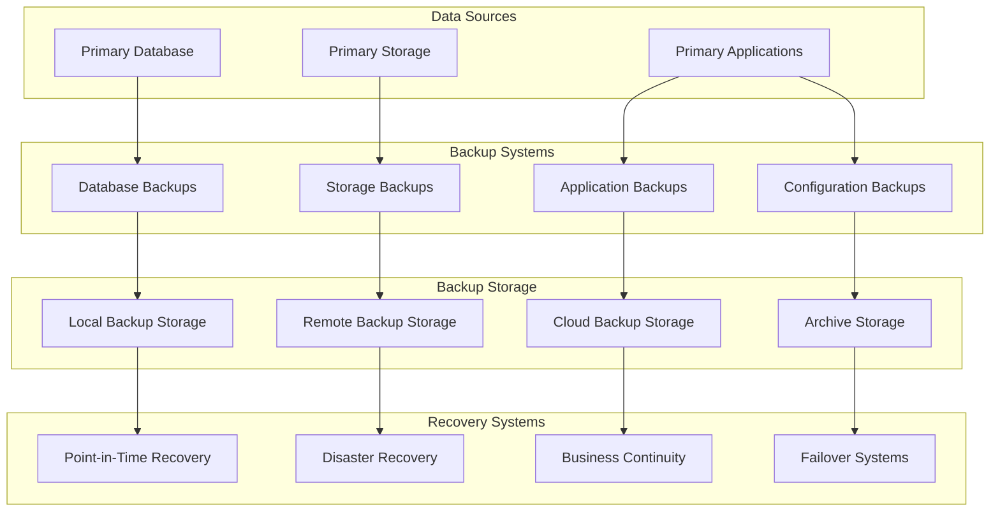

### Failover Architecture

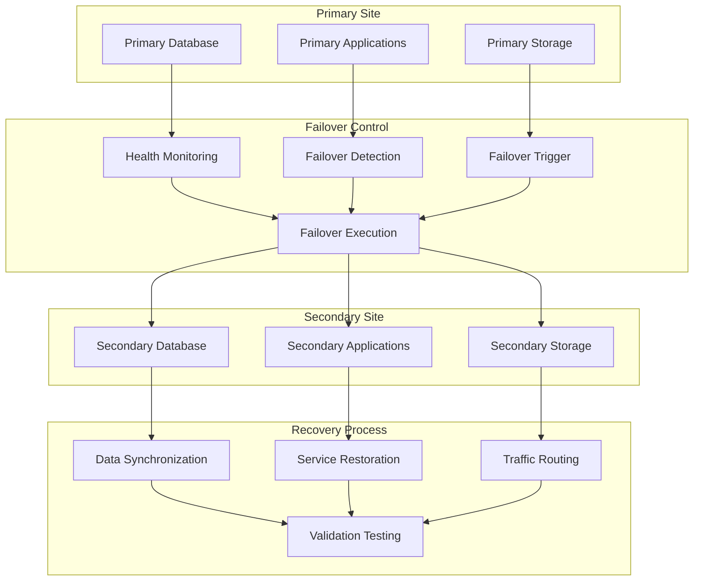

## Performance Architecture

### Caching Strategy

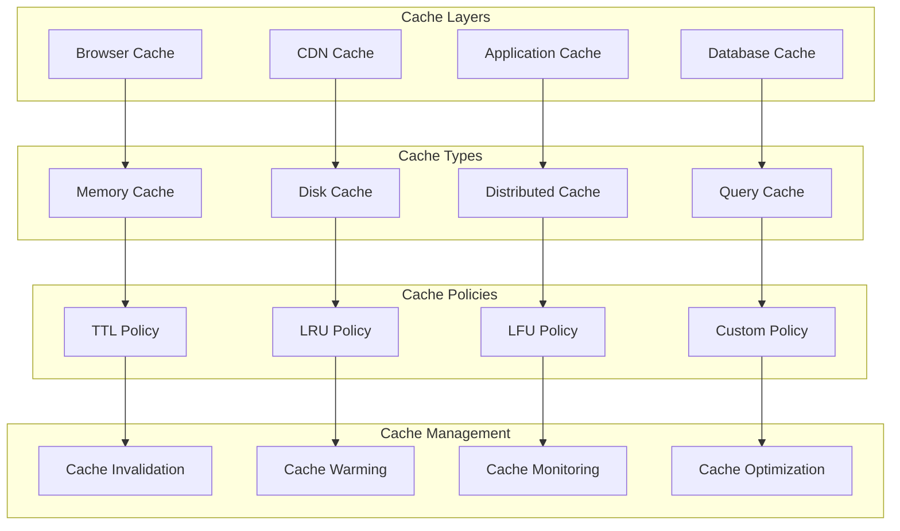

### Load Balancing Strategy

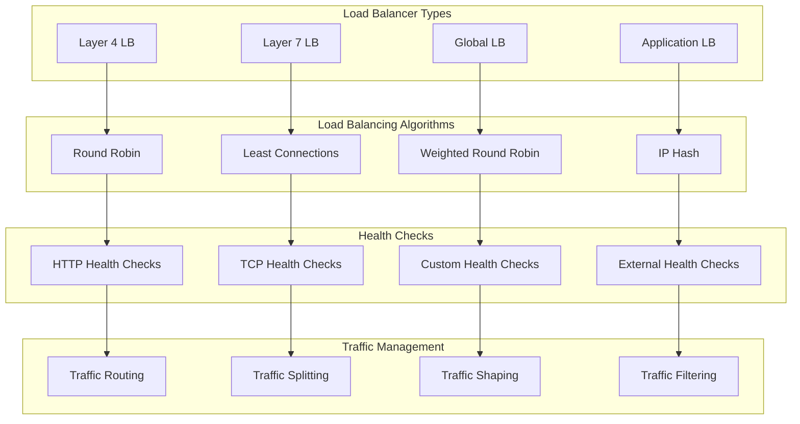

This comprehensive system design provides a complete architectural foundation for your Real-Time Intelligent Data Stream Query Assistant, covering all aspects from data ingestion to user interface, with proper security, scalability, monitoring, and disaster recovery considerations.
