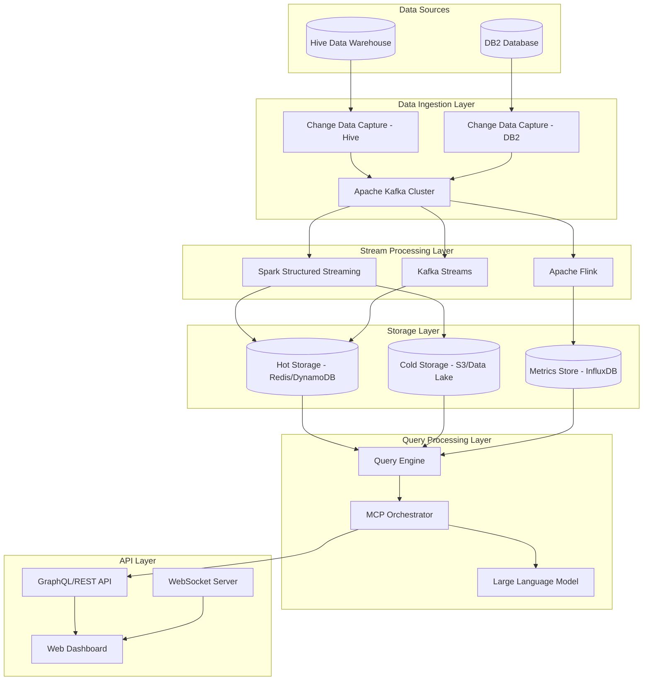
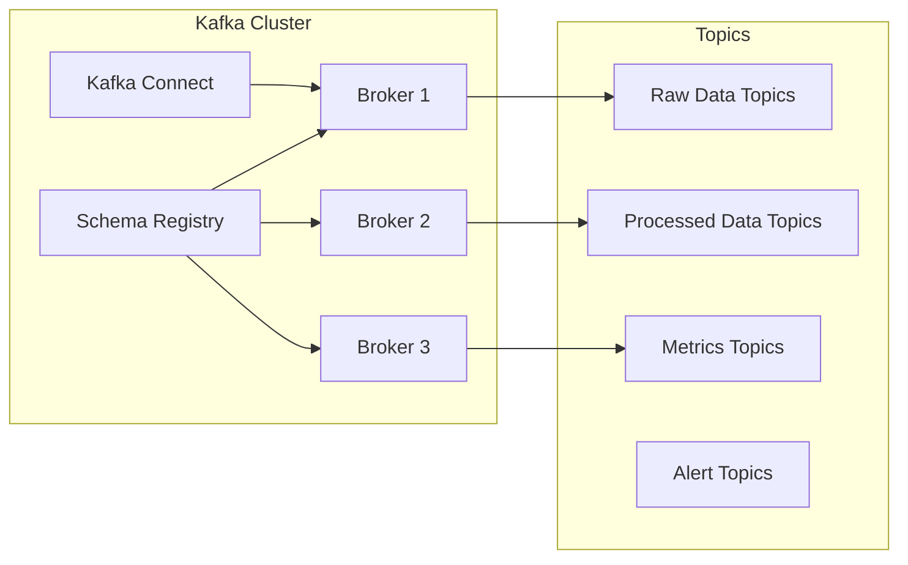
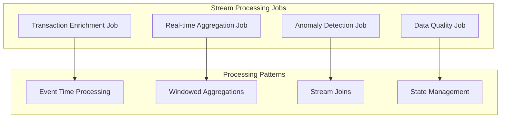
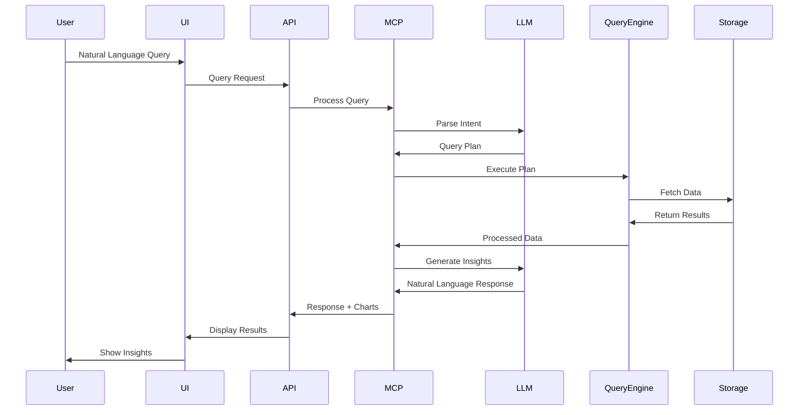
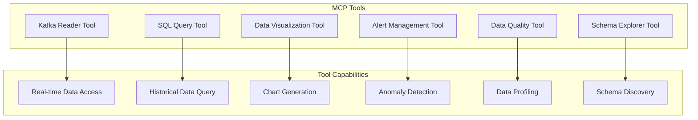
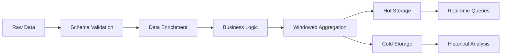
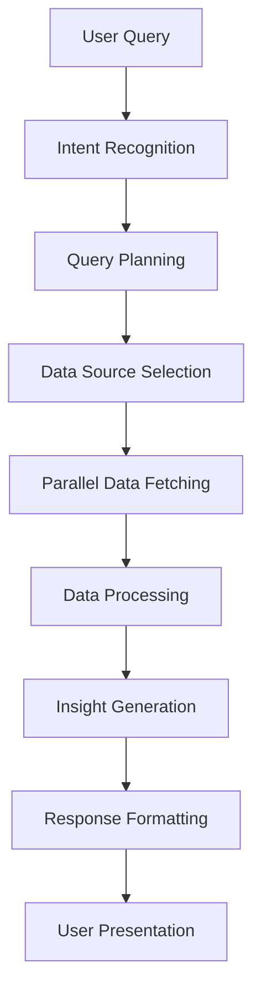
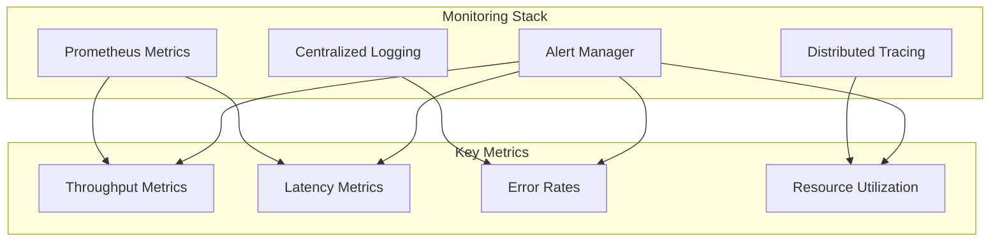

# Real-Time Intelligent Data Stream Query Assistant - System Design

## Overview
This system provides real-time intelligent querying capabilities over streaming data from Hive and DB2 databases through Kafka, with natural language query processing and intelligent insights generation.

## High-Level Architecture

## Detailed Component Design

### 1. Data Sources & Ingestion

#### Hive Integration
- **CDC Method**: Debezium or custom CDC solution
- **Data Format**: Avro with Schema Registry
- **Partitioning**: By date and business entity
- **Topics**: `hive.transactions`, `hive.customers`, `hive.products`

#### DB2 Integration
- **CDC Method**: IBM InfoSphere CDC or Debezium
- **Data Format**: JSON/Avro with schema evolution
- **Partitioning**: By transaction ID and timestamp
- **Topics**: `db2.transactions`, `db2.accounts`, `db2.orders`

### 2. Kafka Cluster Design

**Topic Configuration:**
- **Raw Data Topics**: 3 partitions, 7-day retention
- **Processed Topics**: 6 partitions, 30-day retention
- **Metrics Topics**: 12 partitions, 90-day retention
- **Alert Topics**: 1 partition, 1-day retention

### 3. Stream Processing Architecture

**Stream Processing Features:**
- **Watermarking**: Handle late-arriving data
- **Exactly-Once Processing**: Idempotent operations
- **Backpressure Handling**: Adaptive processing rates
- **Checkpointing**: Fault tolerance and recovery

### 4. Storage Architecture

#### Hot Storage (Sub-second queries)
- **Redis Cluster**: Real-time metrics and counters
- **DynamoDB**: User sessions and recent transactions
- **Apache Pinot**: OLAP queries on recent data

#### Cold Storage (Historical analysis)
- **S3 Data Lake**: Parquet files with partitioning
- **Delta Lake**: ACID transactions on data lake
- **Apache Iceberg**: Schema evolution and time travel

#### Metrics Storage
- **InfluxDB**: Time-series metrics and monitoring
- **Prometheus**: System metrics and alerting
- **Grafana**: Visualization and dashboards

### 5. Query Processing Pipeline

### 6. MCP (Model Context Protocol) Tools

**Tool Specifications:**

1. **Kafka Reader Tool**
   - Read from specific topics with time ranges
   - Support for different serialization formats
   - Automatic schema evolution handling

2. **SQL Query Tool**
   - Query hot storage (Redis, DynamoDB)
   - Query cold storage (S3, Delta Lake)
   - Support for complex joins and aggregations

3. **Data Visualization Tool**
   - Generate charts and graphs
   - Support for real-time updates
   - Export capabilities

4. **Alert Management Tool**
   - Create and manage alert rules
   - Support for complex conditions
   - Integration with notification systems

### 7. Data Flow Patterns

#### Real-time Processing Flow

#### Query Processing Flow

### 8. Security & Governance

#### Data Security
- **Encryption**: At rest and in transit
- **Access Control**: Role-based permissions
- **Data Masking**: PII protection
- **Audit Logging**: Complete audit trail

#### Schema Management
- **Schema Registry**: Centralized schema management
- **Schema Evolution**: Backward/forward compatibility
- **Data Lineage**: Track data transformations
- **Quality Gates**: Automated data validation

### 9. Monitoring & Observability

### 10. Scalability & Performance

#### Horizontal Scaling
- **Kafka**: Add more brokers
- **Stream Processing**: Scale worker nodes
- **Storage**: Shard data across nodes
- **Query Engine**: Load balancing

#### Performance Optimization
- **Caching**: Multi-level caching strategy
- **Indexing**: Optimized data structures
- **Compression**: Data compression techniques
- **Partitioning**: Smart data partitioning

### 11. Disaster Recovery

#### Backup Strategy
- **Real-time Replication**: Cross-region replication
- **Point-in-time Recovery**: Transaction log backups
- **Data Validation**: Automated consistency checks

#### Failover Mechanisms
- **Automatic Failover**: Health check based
- **Circuit Breakers**: Prevent cascade failures
- **Graceful Degradation**: Maintain partial functionality

## Implementation Phases

### Phase 1: Foundation (Weeks 1-4)
- Set up Kafka cluster and schema registry
- Implement CDC for Hive and DB2
- Create basic stream processing jobs
- Set up monitoring and logging

### Phase 2: Core Features (Weeks 5-8)
- Implement MCP tools
- Build query processing engine
- Create basic UI for queries
- Add data visualization capabilities

### Phase 3: Intelligence (Weeks 9-12)
- Integrate LLM for natural language processing
- Implement anomaly detection
- Add alerting and notification system
- Create advanced analytics features

### Phase 4: Production (Weeks 13-16)
- Performance optimization
- Security hardening
- Load testing and tuning
- Production deployment and monitoring

## Technology Stack

### Core Technologies
- **Message Queue**: Apache Kafka
- **Stream Processing**: Apache Spark, Apache Flink
- **Storage**: Redis, DynamoDB, S3, Delta Lake
- **Query Engine**: Apache Pinot, Presto/Trino
- **LLM Integration**: OpenAI GPT-4, Anthropic Claude
- **MCP Framework**: Custom implementation

### Infrastructure
- **Container Orchestration**: Kubernetes
- **Service Mesh**: Istio
- **Monitoring**: Prometheus, Grafana, Jaeger
- **Logging**: ELK Stack (Elasticsearch, Logstash, Kibana)
- **CI/CD**: GitLab CI/CD or GitHub Actions

### Development Tools
- **Language**: Python, Java, Scala
- **Frameworks**: FastAPI, Spring Boot
- **Testing**: Pytest, JUnit, Testcontainers
- **Documentation**: Sphinx, MkDocs

## Cost Estimation

### Infrastructure Costs (Monthly)
- **Kafka Cluster**: $2,000-5,000
- **Stream Processing**: $3,000-8,000
- **Storage**: $1,000-3,000
- **Compute**: $2,000-5,000
- **Monitoring**: $500-1,500

### Total Estimated Cost: $8,500-22,500/month

## Risk Assessment

### Technical Risks
- **Data Consistency**: Mitigated by exactly-once processing
- **Schema Evolution**: Handled by schema registry
- **Performance Bottlenecks**: Addressed by horizontal scaling

### Business Risks
- **Data Privacy**: Mitigated by encryption and access controls
- **Compliance**: Addressed by audit logging and data governance
- **Vendor Lock-in**: Minimized by using open-source technologies

## Success Metrics

### Performance Metrics
- **Query Latency**: < 2 seconds for real-time queries
- **Throughput**: > 100,000 events/second
- **Availability**: 99.9% uptime
- **Data Freshness**: < 30 seconds lag

### Business Metrics
- **User Adoption**: > 80% of data team using the system
- **Query Success Rate**: > 95% successful query execution
- **Time to Insight**: < 5 minutes from query to insight
- **Cost per Query**: < $0.01 per query

This system design provides a comprehensive foundation for building your Real-Time Intelligent Data Stream Query Assistant with proper scalability, reliability, and intelligence capabilities.
