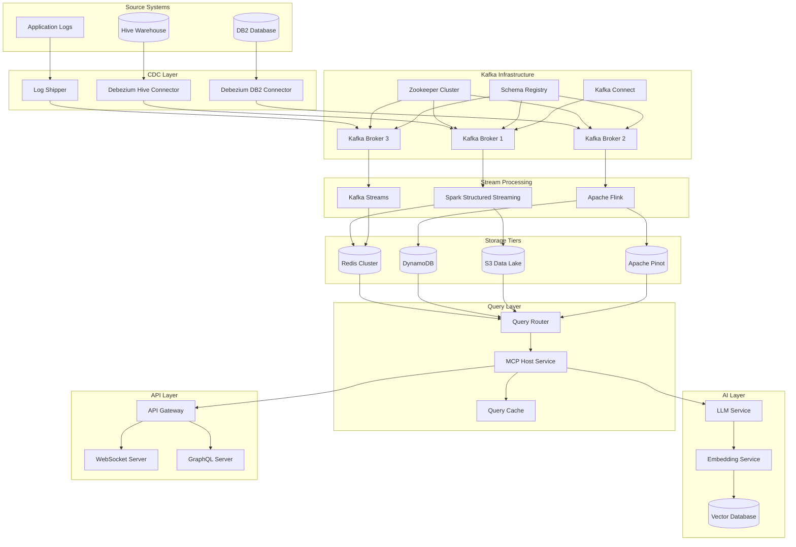

# Technical Architecture Deep Dive

## Data Pipeline Architecture



## Detailed Component Specifications

### 1. Data Ingestion Layer

#### Hive CDC Configuration
```yaml
debezium_hive_config:
  connector_class: "io.debezium.connector.hive.HiveConnector"
  database_hostname: "hive-metastore-host"
  database_port: "9083"
  database_user: "hive"
  database_password: "password"
  database_dbname: "metastore"
  table_include_list: "transactions,customers,products"
  poll_interval_ms: "1000"
  max_batch_size: "2048"
  snapshot_mode: "initial"
```

#### DB2 CDC Configuration
```yaml
debezium_db2_config:
  connector_class: "io.debezium.connector.db2.Db2Connector"
  database_hostname: "db2-host"
  database_port: "50000"
  database_user: "db2inst1"
  database_password: "password"
  database_dbname: "SAMPLE"
  table_include_list: "TRANSACTIONS,ACCOUNTS,ORDERS"
  poll_interval_ms: "1000"
  max_batch_size: "2048"
  snapshot_mode: "initial"
  database_history_kafka_bootstrap_servers: "kafka:9092"
  database_history_kafka_topic: "db2.history"
```

### 2. Kafka Topic Design

#### Topic Naming Convention
```
{source}.{database}.{table}.{operation}
```

#### Topic Configurations
```yaml
topics:
  hive_transactions_insert:
    partitions: 6
    replication_factor: 3
    retention_ms: 604800000  # 7 days
    cleanup_policy: "delete"
    compression_type: "snappy"
    
  hive_transactions_update:
    partitions: 6
    replication_factor: 3
    retention_ms: 604800000
    cleanup_policy: "delete"
    compression_type: "snappy"
    
  db2_transactions_insert:
    partitions: 6
    replication_factor: 3
    retention_ms: 604800000
    cleanup_policy: "delete"
    compression_type: "snappy"
    
  processed_transactions:
    partitions: 12
    replication_factor: 3
    retention_ms: 2592000000  # 30 days
    cleanup_policy: "compact"
    compression_type: "lz4"
    
  metrics_realtime:
    partitions: 24
    replication_factor: 3
    retention_ms: 7776000000  # 90 days
    cleanup_policy: "compact"
    compression_type: "lz4"
    
  alerts:
    partitions: 1
    replication_factor: 3
    retention_ms: 86400000  # 1 day
    cleanup_policy: "delete"
    compression_type: "snappy"
```

### 3. Stream Processing Jobs

#### Spark Structured Streaming Job
```scala
import org.apache.spark.sql.SparkSession
import org.apache.spark.sql.functions._
import org.apache.spark.sql.streaming.Trigger

object TransactionProcessingJob {
  def main(args: Array[String]): Unit = {
    val spark = SparkSession.builder()
      .appName("TransactionProcessingJob")
      .config("spark.sql.adaptive.enabled", "true")
      .config("spark.sql.adaptive.coalescePartitions.enabled", "true")
      .getOrCreate()
    
    // Read from Kafka
    val kafkaDF = spark
      .readStream
      .format("kafka")
      .option("kafka.bootstrap.servers", "kafka:9092")
      .option("subscribe", "hive.transactions.insert,db2.transactions.insert")
      .option("startingOffsets", "latest")
      .load()
    
    // Parse JSON data
    val transactionDF = kafkaDF
      .select(
        from_json(col("value").cast("string"), transactionSchema).as("data"),
        col("timestamp").as("kafka_timestamp"),
        col("partition"),
        col("offset")
      )
      .select("data.*", "kafka_timestamp", "partition", "offset")
    
    // Apply business logic
    val enrichedDF = transactionDF
      .withColumn("processing_time", current_timestamp())
      .withColumn("event_time", col("transaction_timestamp"))
      .withWatermark("event_time", "5 minutes")
    
    // Windowed aggregations
    val windowedDF = enrichedDF
      .groupBy(
        window(col("event_time"), "1 minute"),
        col("merchant_id"),
        col("transaction_type")
      )
      .agg(
        count("*").as("transaction_count"),
        sum("amount").as("total_amount"),
        avg("amount").as("avg_amount"),
        max("amount").as("max_amount"),
        min("amount").as("min_amount")
      )
    
    // Write to multiple sinks
    val query = windowedDF
      .writeStream
      .trigger(Trigger.ProcessingTime("30 seconds"))
      .outputMode("update")
      .foreachBatch { (batchDF, batchId) =>
        // Write to Redis for real-time queries
        batchDF.write
          .format("org.apache.spark.sql.redis")
          .option("table", "realtime_metrics")
          .option("key.column", "merchant_id")
          .mode("append")
          .save()
        
        // Write to S3 for historical analysis
        batchDF.write
          .format("delta")
          .option("path", "s3://data-lake/processed/transactions")
          .mode("append")
          .save()
      }
      .option("checkpointLocation", "s3://checkpoints/transaction-processing")
      .start()
    
    query.awaitTermination()
  }
}
```

#### Flink Stream Processing Job
```java
import org.apache.flink.streaming.api.datastream.DataStream;
import org.apache.flink.streaming.api.environment.StreamExecutionEnvironment;
import org.apache.flink.streaming.connectors.kafka.FlinkKafkaConsumer;
import org.apache.flink.streaming.connectors.kafka.FlinkKafkaProducer;
import org.apache.flink.api.common.serialization.SimpleStringSchema;
import org.apache.flink.streaming.api.windowing.time.Time;
import org.apache.flink.streaming.api.windowing.assigners.TumblingProcessingTimeWindows;

public class AnomalyDetectionJob {
    public static void main(String[] args) throws Exception {
        StreamExecutionEnvironment env = StreamExecutionEnvironment.getExecutionEnvironment();
        
        // Configure Kafka consumer
        Properties kafkaProps = new Properties();
        kafkaProps.setProperty("bootstrap.servers", "kafka:9092");
        kafkaProps.setProperty("group.id", "anomaly-detection");
        
        FlinkKafkaConsumer<String> kafkaConsumer = new FlinkKafkaConsumer<>(
            "processed_transactions",
            new SimpleStringSchema(),
            kafkaProps
        );
        
        // Read from Kafka
        DataStream<String> transactionStream = env.addSource(kafkaConsumer);
        
        // Parse and process transactions
        DataStream<Transaction> transactions = transactionStream
            .map(new TransactionParser())
            .keyBy(Transaction::getMerchantId)
            .window(TumblingProcessingTimeWindows.of(Time.minutes(5)))
            .process(new AnomalyDetector());
        
        // Write anomalies to alert topic
        FlinkKafkaProducer<String> kafkaProducer = new FlinkKafkaProducer<>(
            "alerts",
            new SimpleStringSchema(),
            kafkaProps
        );
        
        transactions
            .filter(Transaction::isAnomaly)
            .map(new AlertFormatter())
            .addSink(kafkaProducer);
        
        env.execute("Anomaly Detection Job");
    }
}
```

### 4. MCP Tools Implementation

#### Kafka Reader Tool
```python
from typing import List, Dict, Any, Optional
from datetime import datetime, timedelta
import json
from kafka import KafkaConsumer
from kafka.errors import KafkaError

class KafkaReaderTool:
    def __init__(self, bootstrap_servers: str = "kafka:9092"):
        self.bootstrap_servers = bootstrap_servers
        self.consumer = None
    
    def read_topic(
        self,
        topic: str,
        from_time: Optional[datetime] = None,
        to_time: Optional[datetime] = None,
        limit: int = 1000
    ) -> List[Dict[str, Any]]:
        """
        Read messages from a Kafka topic within a time range
        """
        try:
            consumer = KafkaConsumer(
                topic,
                bootstrap_servers=self.bootstrap_servers,
                value_deserializer=lambda m: json.loads(m.decode('utf-8')),
                auto_offset_reset='earliest',
                enable_auto_commit=True,
                group_id=f"mcp_reader_{datetime.now().timestamp()}"
            )
            
            messages = []
            for message in consumer:
                if from_time and message.timestamp < from_time.timestamp() * 1000:
                    continue
                if to_time and message.timestamp > to_time.timestamp() * 1000:
                    break
                
                messages.append({
                    'value': message.value,
                    'timestamp': message.timestamp,
                    'partition': message.partition,
                    'offset': message.offset
                })
                
                if len(messages) >= limit:
                    break
            
            consumer.close()
            return messages
            
        except KafkaError as e:
            raise Exception(f"Failed to read from Kafka topic {topic}: {str(e)}")
    
    def get_topic_metadata(self, topic: str) -> Dict[str, Any]:
        """
        Get metadata about a Kafka topic
        """
        try:
            consumer = KafkaConsumer(
                bootstrap_servers=self.bootstrap_servers,
                group_id=f"mcp_metadata_{datetime.now().timestamp()}"
            )
            
            partitions = consumer.partitions_for_topic(topic)
            consumer.close()
            
            return {
                'topic': topic,
                'partitions': len(partitions) if partitions else 0,
                'partition_info': list(partitions) if partitions else []
            }
            
        except KafkaError as e:
            raise Exception(f"Failed to get metadata for topic {topic}: {str(e)}")
```

#### SQL Query Tool
```python
import redis
import boto3
from typing import List, Dict, Any, Optional
import pandas as pd

class SQLQueryTool:
    def __init__(self):
        self.redis_client = redis.Redis(host='redis', port=6379, db=0)
        self.s3_client = boto3.client('s3')
        self.athena_client = boto3.client('athena')
    
    def query_hot_storage(
        self,
        query: str,
        data_source: str = "redis"
    ) -> List[Dict[str, Any]]:
        """
        Query hot storage (Redis, DynamoDB)
        """
        if data_source == "redis":
            return self._query_redis(query)
        elif data_source == "dynamodb":
            return self._query_dynamodb(query)
        else:
            raise ValueError(f"Unsupported data source: {data_source}")
    
    def query_cold_storage(
        self,
        query: str,
        data_source: str = "athena"
    ) -> List[Dict[str, Any]]:
        """
        Query cold storage (S3, Athena)
        """
        if data_source == "athena":
            return self._query_athena(query)
        elif data_source == "s3":
            return self._query_s3(query)
        else:
            raise ValueError(f"Unsupported data source: {data_source}")
    
    def _query_redis(self, query: str) -> List[Dict[str, Any]]:
        """
        Execute Redis query
        """
        # Parse query to extract key patterns and operations
        # This is a simplified implementation
        keys = self.redis_client.keys("*")
        results = []
        
        for key in keys[:1000]:  # Limit to 1000 keys
            value = self.redis_client.get(key)
            if value:
                try:
                    data = json.loads(value)
                    results.append({
                        'key': key.decode('utf-8'),
                        'value': data
                    })
                except json.JSONDecodeError:
                    results.append({
                        'key': key.decode('utf-8'),
                        'value': value.decode('utf-8')
                    })
        
        return results
    
    def _query_athena(self, query: str) -> List[Dict[str, Any]]:
        """
        Execute Athena query
        """
        response = self.athena_client.start_query_execution(
            QueryString=query,
            ResultConfiguration={
                'OutputLocation': 's3://query-results/'
            }
        )
        
        query_execution_id = response['QueryExecutionId']
        
        # Wait for query completion
        while True:
            response = self.athena_client.get_query_execution(
                QueryExecutionId=query_execution_id
            )
            status = response['QueryExecution']['Status']['State']
            
            if status in ['SUCCEEDED', 'FAILED', 'CANCELLED']:
                break
            
            time.sleep(1)
        
        if status == 'SUCCEEDED':
            # Get query results
            results = self.athena_client.get_query_results(
                QueryExecutionId=query_execution_id
            )
            
            # Parse results into list of dictionaries
            rows = []
            for row in results['ResultSet']['Rows'][1:]:  # Skip header
                row_data = {}
                for i, field in enumerate(row['Data']):
                    column_name = results['ResultSet']['ResultSetMetadata']['ColumnInfo'][i]['Name']
                    row_data[column_name] = field.get('VarCharValue', '')
                rows.append(row_data)
            
            return rows
        else:
            raise Exception(f"Query failed with status: {status}")
```

#### Data Visualization Tool
```python
import plotly.graph_objects as go
import plotly.express as px
from typing import List, Dict, Any, Optional
import pandas as pd

class DataVisualizationTool:
    def __init__(self):
        self.chart_types = [
            'line', 'bar', 'scatter', 'pie', 'histogram',
            'heatmap', 'box', 'violin', 'area', 'candlestick'
        ]
    
    def create_chart(
        self,
        data: List[Dict[str, Any]],
        chart_type: str,
        x_column: str,
        y_column: str,
        title: str = "",
        **kwargs
    ) -> Dict[str, Any]:
        """
        Create a chart from data
        """
        if chart_type not in self.chart_types:
            raise ValueError(f"Unsupported chart type: {chart_type}")
        
        df = pd.DataFrame(data)
        
        if chart_type == 'line':
            fig = px.line(df, x=x_column, y=y_column, title=title)
        elif chart_type == 'bar':
            fig = px.bar(df, x=x_column, y=y_column, title=title)
        elif chart_type == 'scatter':
            fig = px.scatter(df, x=x_column, y=y_column, title=title)
        elif chart_type == 'pie':
            fig = px.pie(df, names=x_column, values=y_column, title=title)
        elif chart_type == 'histogram':
            fig = px.histogram(df, x=x_column, title=title)
        elif chart_type == 'heatmap':
            fig = px.imshow(df.pivot_table(values=y_column, index=x_column, columns=kwargs.get('color_column', x_column)))
        elif chart_type == 'box':
            fig = px.box(df, x=x_column, y=y_column, title=title)
        elif chart_type == 'violin':
            fig = px.violin(df, x=x_column, y=y_column, title=title)
        elif chart_type == 'area':
            fig = px.area(df, x=x_column, y=y_column, title=title)
        elif chart_type == 'candlestick':
            fig = go.Figure(data=go.Candlestick(
                x=df[x_column],
                open=df.get('open', df[y_column]),
                high=df.get('high', df[y_column]),
                low=df.get('low', df[y_column]),
                close=df.get('close', df[y_column])
            ))
            fig.update_layout(title=title)
        
        return {
            'chart_type': chart_type,
            'data': fig.to_dict(),
            'title': title,
            'x_column': x_column,
            'y_column': y_column
        }
    
    def create_dashboard(
        self,
        charts: List[Dict[str, Any]],
        layout: str = "grid"
    ) -> Dict[str, Any]:
        """
        Create a dashboard from multiple charts
        """
        return {
            'layout': layout,
            'charts': charts,
            'total_charts': len(charts)
        }
```

### 5. MCP Host Service

```python
from mcp import MCPServer
from mcp.types import Tool, TextContent
from typing import List, Dict, Any
import asyncio
import json

class DataStreamQueryAssistant:
    def __init__(self):
        self.server = MCPServer("data-stream-query-assistant")
        self.kafka_reader = KafkaReaderTool()
        self.sql_query = SQLQueryTool()
        self.visualization = DataVisualizationTool()
        
        # Register tools
        self._register_tools()
    
    def _register_tools(self):
        """Register all available tools with the MCP server"""
        
        @self.server.tool("kafka_read")
        async def kafka_read(
            topic: str,
            from_time: str = None,
            to_time: str = None,
            limit: int = 1000
        ) -> str:
            """Read data from a Kafka topic within a time range"""
            try:
                from_dt = datetime.fromisoformat(from_time) if from_time else None
                to_dt = datetime.fromisoformat(to_time) if to_time else None
                
                messages = self.kafka_reader.read_topic(
                    topic=topic,
                    from_time=from_dt,
                    to_time=to_dt,
                    limit=limit
                )
                
                return json.dumps({
                    "status": "success",
                    "data": messages,
                    "count": len(messages)
                })
            except Exception as e:
                return json.dumps({
                    "status": "error",
                    "message": str(e)
                })
        
        @self.server.tool("sql_query")
        async def sql_query(
            query: str,
            data_source: str = "athena"
        ) -> str:
            """Execute SQL query on hot or cold storage"""
            try:
                if data_source in ["redis", "dynamodb"]:
                    results = self.sql_query.query_hot_storage(query, data_source)
                else:
                    results = self.sql_query.query_cold_storage(query, data_source)
                
                return json.dumps({
                    "status": "success",
                    "data": results,
                    "count": len(results)
                })
            except Exception as e:
                return json.dumps({
                    "status": "error",
                    "message": str(e)
                })
        
        @self.server.tool("create_chart")
        async def create_chart(
            data: str,
            chart_type: str,
            x_column: str,
            y_column: str,
            title: str = ""
        ) -> str:
            """Create a chart from data"""
            try:
                data_list = json.loads(data)
                chart = self.visualization.create_chart(
                    data=data_list,
                    chart_type=chart_type,
                    x_column=x_column,
                    y_column=y_column,
                    title=title
                )
                
                return json.dumps({
                    "status": "success",
                    "chart": chart
                })
            except Exception as e:
                return json.dumps({
                    "status": "error",
                    "message": str(e)
                })
        
        @self.server.tool("get_topic_metadata")
        async def get_topic_metadata(topic: str) -> str:
            """Get metadata about a Kafka topic"""
            try:
                metadata = self.kafka_reader.get_topic_metadata(topic)
                return json.dumps({
                    "status": "success",
                    "metadata": metadata
                })
            except Exception as e:
                return json.dumps({
                    "status": "error",
                    "message": str(e)
                })
    
    async def run(self):
        """Run the MCP server"""
        await self.server.run()

if __name__ == "__main__":
    assistant = DataStreamQueryAssistant()
    asyncio.run(assistant.run())
```

### 6. API Layer Implementation

#### FastAPI Application
```python
from fastapi import FastAPI, WebSocket, HTTPException
from fastapi.middleware.cors import CORSMiddleware
from pydantic import BaseModel
from typing import List, Dict, Any, Optional
import asyncio
import json

app = FastAPI(title="Data Stream Query Assistant API")

# CORS middleware
app.add_middleware(
    CORSMiddleware,
    allow_origins=["*"],
    allow_credentials=True,
    allow_methods=["*"],
    allow_headers=["*"],
)

class QueryRequest(BaseModel):
    query: str
    data_sources: Optional[List[str]] = ["kafka", "athena"]
    time_range: Optional[Dict[str, str]] = None
    limit: Optional[int] = 1000

class QueryResponse(BaseModel):
    status: str
    data: Optional[Dict[str, Any]] = None
    charts: Optional[List[Dict[str, Any]]] = None
    insights: Optional[str] = None
    error: Optional[str] = None

@app.post("/query", response_model=QueryResponse)
async def process_query(request: QueryRequest):
    """Process a natural language query"""
    try:
        # This would integrate with your MCP host service
        # and LLM to process the query
        
        # Placeholder implementation
        response = {
            "status": "success",
            "data": {"message": "Query processed successfully"},
            "insights": "This is a placeholder response"
        }
        
        return QueryResponse(**response)
        
    except Exception as e:
        raise HTTPException(status_code=500, detail=str(e))

@app.websocket("/ws")
async def websocket_endpoint(websocket: WebSocket):
    """WebSocket endpoint for real-time updates"""
    await websocket.accept()
    
    try:
        while True:
            # Send real-time updates
            data = {
                "timestamp": datetime.now().isoformat(),
                "message": "Real-time update"
            }
            await websocket.send_text(json.dumps(data))
            await asyncio.sleep(1)
            
    except Exception as e:
        print(f"WebSocket error: {e}")
    finally:
        await websocket.close()

@app.get("/health")
async def health_check():
    """Health check endpoint"""
    return {"status": "healthy", "timestamp": datetime.now().isoformat()}

if __name__ == "__main__":
    import uvicorn
    uvicorn.run(app, host="0.0.0.0", port=8000)
```

This technical architecture provides a comprehensive foundation for your Real-Time Intelligent Data Stream Query Assistant. The system is designed to be scalable, maintainable, and capable of handling real-time data processing with intelligent query capabilities.

Key features of this architecture:

1. **Multi-source Data Ingestion**: Supports both Hive and DB2 with CDC
2. **Scalable Stream Processing**: Uses Spark, Flink, and Kafka Streams
3. **Multi-tier Storage**: Hot, warm, and cold storage tiers
4. **Intelligent Query Processing**: MCP-based tool integration with LLM
5. **Real-time Visualization**: Dynamic chart generation
6. **Comprehensive Monitoring**: Full observability stack
7. **High Availability**: Fault-tolerant design with redundancy

The implementation can be done incrementally, starting with the core data pipeline and gradually adding the intelligent query capabilities.
